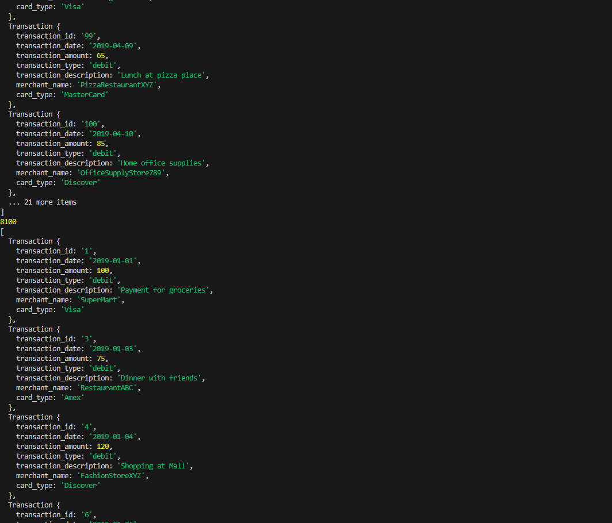

# Руководство по проекту: Консольное приложение для анализа транзакций

## Инструкции по запуску проекта
1. Убедитесь, что на вашем компьютере установлен Node.js. Вы можете скачать и установить его с официального сайта [Node.js](https://nodejs.org/).
2. Клонируйте репозиторий проекта или создайте необходимые файлы локально.
3. Создайте файл `transaction.json` в корне проекта и вставьте туда данные транзакций.
4. Убедитесь, что файл `index.js` содержит указанный в задании код.
5. В терминале выполните команду `npm install` для установки зависимостей (если применимо).
6. Запустите приложение с помощью команды:
   ```bash
   node index.js
   ```

## Описание индивидуальной работы
**Цель**: Изучить основные концепции программирования на JavaScript через разработку консольного приложения для анализа транзакций.

В рамках этой работы вы реализуете:
- Чтение данных из JSON-файла.
- Создание классов `Transaction` и `TransactionAnalyzer`.
- Реализацию методов для обработки и анализа транзакций.
- Применение методов JavaScript, таких как `filter`, `reduce`, `map`.

## Краткая документация к проекту

### Класс `Transaction`
Класс представляет отдельную транзакцию с следующими свойствами:
- `transaction_id`: Уникальный идентификатор транзакции.
- `transaction_date`: Дата транзакции (строка в формате `YYYY-MM-DD`).
- `transaction_amount`: Сумма транзакции.
- `transaction_type`: Тип транзакции (`debit` или `credit`).
- `transaction_description`: Описание транзакции.
- `merchant_name`: Название торговца.
- `card_type`: Тип карты (`Visa`, `MasterCard`).

Методы:
- `string()`: Возвращает строковое представление транзакции в формате JSON.

### Класс `TransactionAnalyzer`
Класс предоставляет методы для анализа массива транзакций:
- `addTransaction(transaction)`: Добавляет новую транзакцию в массив данных.
- `getAllTransaction()`: Возвращает массив всех транзакций.
- `getUniqueTransactionType()`: Возвращает уникальные типы транзакций.
- `calculateTotalAmount()`: Рассчитывает общую сумму всех транзакций.
- `calculateTotalAmountByDate(year, month, day)`: Вычисляет общую сумму транзакций за указанный период.
- `getTransactionByType(type)`: Возвращает транзакции указанного типа.
- `getTransactionsInDateRange(startDate, endDate)`: Возвращает транзакции в указанном диапазоне дат.
- `getTransactionsByMerchant(merchantName)`: Возвращает транзакции по торговцу.
- `calculateAverageTransactionAmount()`: Возвращает среднюю сумму транзакций.
- `getTransactionsByAmountRange(minAmount, maxAmount)`: Возвращает транзакции в диапазоне сумм.
- `calculateTotalDebitAmount()`: Рассчитывает общую сумму дебетовых транзакций.
- `findMostTransactionsMonth()`: Определяет месяц с наибольшим количеством транзакций.
- `findMostDebitTransactionMonth()`: Определяет месяц с наибольшим количеством дебетовых транзакций.
- `mostTransactionTypes()`: Определяет, каких транзакций больше всего.
- `getTransactionsBeforeDate(date)`: Возвращает транзакции, совершенные до указанной даты.
- `findTransactionById(id)`: Находит транзакцию по её ID.
- `mapTransactionDescriptions()`: Возвращает массив описаний транзакций.

## Примеры использования проекта

### Пример 1: Чтение транзакций
```javascript
console.log(object1.getAllTransaction());
```
**Результат**: Массив всех транзакций.

### Пример 2: Расчёт общей суммы транзакций
```javascript
console.log(object1.calculateTotalAmount());
```
**Результат**: Общая сумма всех транзакций.

### Пример 3: Транзакции по типу
```javascript
console.log(object1.getTransactionByType("debit"));
```
**Результат**: Список всех дебетовых транзакций.

### Скриншот вывода

## Ответы на контрольные вопросы
1. **Какие методы класса `TransactionAnalyzer` позволяют работать с датами?**
   - `calculateTotalAmountByDate`
   - `getTransactionsInDateRange`
   - `getTransactionsBeforeDate`
2. **Что делает метод `mapTransactionDescriptions`?**
   - Возвращает массив строк, представляющих описания транзакций.
3. **Какова основная цель метода `addTransaction`?**
   - Добавить новую транзакцию в массив данных.

## Список использованных источников
1. [Официальная документация Node.js](https://nodejs.org/)
2. [MDN Web Docs: JavaScript](https://developer.mozilla.org/ru/docs/Web/JavaScript)
3. [Stack Overflow](https://stackoverflow.com/)

## Дополнительные важные аспекты
- Для форматирования даты и времени можно использовать библиотеку [Moment.js](https://momentjs.com/) или `Intl.DateTimeFormat`.

